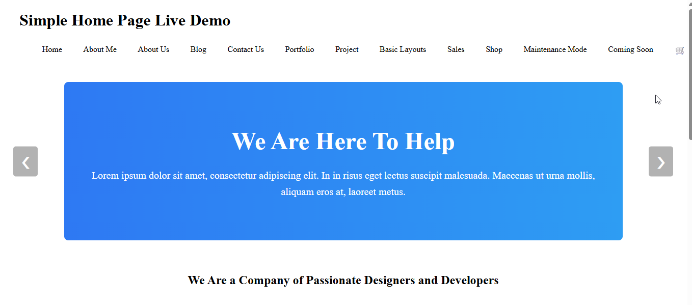

# Elegan5 - Proyecto Astro

## Resumen
Elegan5 es un sitio web construido con **Astro**, enfocado en **componentes reutilizables**, **navegación fluida** y **optimización de imágenes**. Incluye layouts base, routing interno con submenús, y buenas prácticas de SEO. El proyecto está desplegado como página estática en **GitHub Pages**.

## Funcionalidades implementadas
- **Layout base** con `<Header />` y `<Footer />` usando `<slot />`.  
- **Componentes reutilizables** que reciben `props` y se utilizan en varias páginas.  
- **Routing interno** con al menos 4 páginas clonadas y sus submenús:  
  - Home  
  - About Me  
  - Blog  
  - Coming Soon  
- **Imágenes optimizadas** usando `<Image />` y/o `<Picture />` para mejorar el rendimiento.  
- **Transiciones entre páginas** (View Transitions) para una navegación más fluida.  
- **Prefetch** en enlaces internos para mejorar la experiencia de usuario.  
- **SEO básico**: Componente `<Head />` que recibe `title` y `description` dinámicamente en cada página.  

## Despliegue
El proyecto está desplegado como página estática en **GitHub Pages**:

- Repositorio: [https://github.com/jjasUSA/elegan5](https://github.com/jjasUSA/elegan5)  
- Sitio público: [https://jjasusa.github.io/elegan5/](https://jjasusa.github.io/elegan5/)  

## Capturas ruta relativa
  
   

### Capturas Con enlace directo de GitHub

> **Nota:** Se recomienda mover las capturas a una carpeta `assets` dentro del repositorio para que se vean correctamente en GitHub.

## Aprendizajes
- Migración de un proyecto nativo a Astro manteniendo la estructura y el historial de Git.  
- Creación de layouts y componentes reutilizables con `props`.  
- Implementación de navegación fluida con transiciones y prefetch.  
- Optimización de imágenes y manejo básico de SEO por página.  
- Uso de Git para ramas, commits y despliegue a GitHub Pages.
